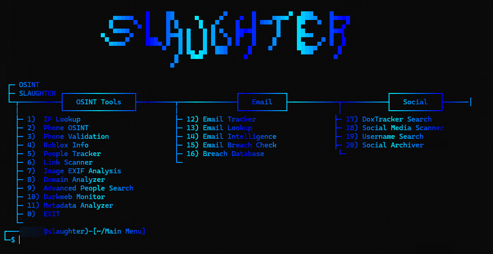

<div style="text-align: center;">
  
  <h1>Slaughter OSINT</h1>
  <p><em>Made by pxwild</em></p>
</div>

# BETA RELEASE

This is Slaughter OSINT in its beta version. It provides core functionality for intelligence gathering, with significant enhancements planned for future updates as development time allows.

**Note on Capabilities:** This tool cannot provide 100% information about an individual and is not intended to do so. Firstly, as it is in beta, and secondly, this reflects the nature of OSINT, which relies on publicly available data and is inherently incomplete.

## Quick Start Guide

Slaughter OSINT is a comprehensive toolkit for ethical intelligence gathering. It includes tools for username enumeration, breach detection, social media scanning, and more, all designed to operate without external API dependencies.

### Step 1: Install Dependencies
```bash
pip install -r requirements.txt
```

### Step 2: Run the Tool
```bash
python slaughter.py
```

## Requirements

- **Python**: 3.8 or higher (tested on 3.12)
- **pip**: Latest version
- **Operating System**: Compatible with Linux, macOS, and Windows

The tools operate offline where possible, using local processing and stealthy web scraping.

## preview




## Disclaimer

**THIS TOOL IS FOR EDUCATIONAL AND AUTHORIZED TESTING PURPOSES ONLY.** Unauthorized access to computer systems, networks, or data is illegal. Always obtain proper authorization before conducting any security research or penetration testing. The authors of this tool are not responsible for any misuse or damage caused by this program.

---

Slaughter OSINT © 2025 pxwild. Use responsibly.  
```
